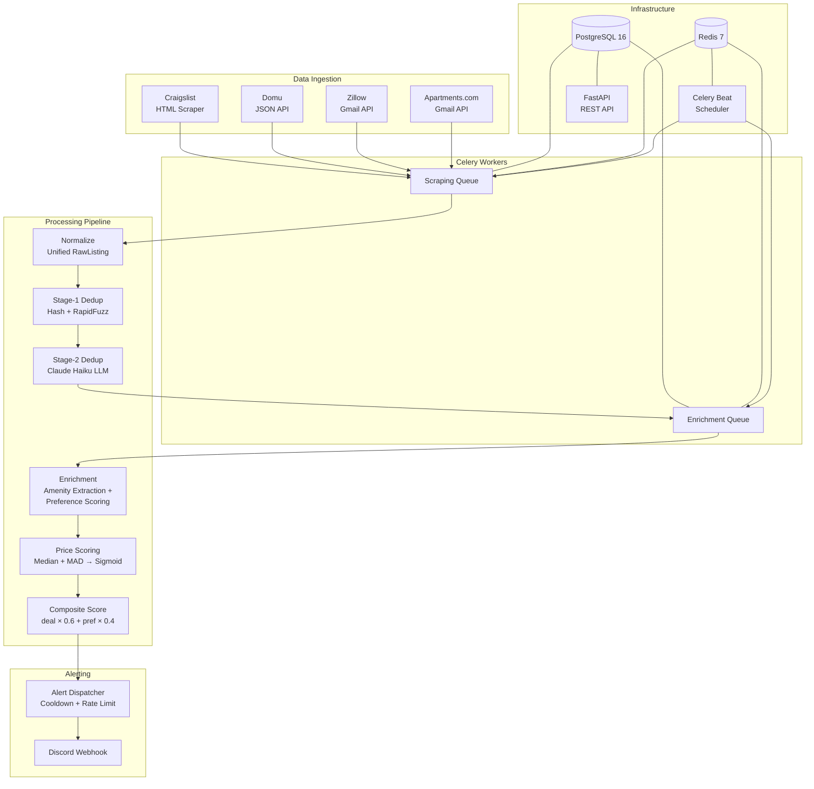

# Apartment Rental Deal Scanner

A Chicago apartment rental deal scanner that continuously scrapes listings from multiple sources, builds a statistical fair-market-value model per neighborhood, and fires Discord alerts for statistically underpriced listings ranked by a composite deal + personal-fit score.

## Architecture



## Features

- **4 data sources**: Craigslist (HTML), Domu (JSON API), Zillow (email), Apartments.com (email)
- **LLM enrichment**: Claude Haiku extracts structured amenities and scores personal fit
- **Statistical deal scoring**: Median + MAD z-scores with sigmoid normalization per neighborhood
- **Cross-source dedup**: Hash matching + fuzzy matching + LLM confirmation
- **Composite ranking**: Configurable deal × preference weighting
- **Discord alerts**: Priority-ranked with 24h cooldown and daily rate limits
- **Staleness detection**: Automatic TTL-based lifecycle management
- **Nightly backups**: pg_dump to S3 with retention policy
- **Multi-user ready**: Schema scaffolded for per-user preferences and alerts

## Tech Stack

| Layer | Choice |
|-------|--------|
| Language | Python 3.12 |
| API | FastAPI |
| Job Queue | Celery + Redis |
| Database | PostgreSQL 16 (Alembic migrations) |
| LLM | Claude Haiku (`claude-haiku-4-5-20251001`) |
| Containers | Docker Compose |
| Deployment | AWS EC2 t3.small |
| Alerts | Discord webhook |

## Prerequisites

- Docker Desktop (for PostgreSQL + Redis)
- Python 3.12+
- Anthropic API key
- Discord webhook URL (optional for dev)
- Gmail API credentials (optional — for Zillow/Apartments.com email ingestion)

## Quick Start

```bash
# 1. Clone and enter the project
git clone <repo-url>
cd apartment-scraper

# 2. Start infrastructure
docker compose -f docker-compose.dev.yml up -d

# 3. Create virtual environment
python -m venv venv
source venv/bin/activate       # Linux/Mac
.\venv\Scripts\activate        # Windows

# 4. Install dependencies
pip install -r requirements.txt

# 5. Configure environment
cp .env.example .env
# Edit .env with your API keys

# 6. Run database migrations
alembic upgrade head

# 7. Start the API server
uvicorn app.main:app --reload

# 8. Start Celery workers (each in its own terminal)
celery -A app.workers.celery_app worker --queues=scraping --pool=solo --loglevel=info
celery -A app.workers.celery_app worker --queues=enrichment --pool=solo --loglevel=info
celery -A app.workers.celery_app beat --loglevel=info
```

## Configuration

### preferences.yaml

Controls search criteria, scoring weights, and alert thresholds:

```yaml
search:
  target_city: chicago
  neighborhoods: [lincoln_park, wicker_park, logan_square, ...]

pricing:
  max_price: 2200
  alert_threshold: 0.15    # Must be 15% below median to alert

scoring:
  weights:
    deal: 0.6              # Price-based deal score weight
    preference: 0.4        # LLM preference score weight
  min_composite_score: 0.55

staleness:
  ttl_days: 14             # Mark unseen listings as stale after N days
```

### Environment Variables

| Variable | Required | Description |
|----------|----------|-------------|
| `DATABASE_URL` | Yes | PostgreSQL connection string |
| `ANTHROPIC_API_KEY` | Yes | Claude API key for enrichment |
| `CELERY_BROKER_URL` | Yes | Redis URL for Celery broker |
| `DISCORD_WEBHOOK_URL` | No | Discord webhook for alerts |
| `BACKUP_S3_BUCKET` | No | S3 bucket for nightly backups |
| `BACKUP_S3_PREFIX` | No | S3 key prefix (default: `apartment-scraper/backups/`) |
| `BACKUP_RETENTION_DAYS` | No | Days to retain old backups (default: 30) |

## API Endpoints

| Endpoint | Method | Description |
|----------|--------|-------------|
| `/health` | GET | Database connectivity check |
| `/status` | GET | Dashboard: listing counts, source breakdown, enrichment stats |
| `/listings` | GET | Query listings with filters (source, neighborhood, max_price) |
| `/alerts/recent` | GET | Recent fired alerts with scores |
| `/price-distribution/{neighborhood}/{bedrooms}` | GET | Price stats for a segment |

## How Scoring Works

1. **Price distributions** are computed per (neighborhood, bedroom_count) using a 60-day rolling window
2. **Deal score** uses a modified z-score: `1 / (1 + exp(0.6745 × (price - median) / MAD))` — robust to outliers via Median Absolute Deviation
3. **Preference score** (0.0–1.0) is computed by Claude Haiku against your amenity requirements and neighborhood vibe preferences
4. **Composite score** = `deal_score × 0.6 + preference_score × 0.4` (configurable weights)
5. **Alert gate**: Only fires when composite ≥ 0.55, price is ≥ 15% below median, and the neighborhood segment has ≥ 20 samples

## Project Structure

```
app/
├── api/                    # FastAPI routes
├── core/                   # Config, database, logging, neighborhoods
├── email/                  # Gmail client + Zillow/Apartments.com parsers
├── models/                 # SQLAlchemy ORM models
│   ├── listing.py          # Core listings table
│   ├── enrichment.py       # LLM enrichment results
│   ├── dedup.py            # Cross-source duplicate pairs
│   ├── alert.py            # Alert history
│   ├── price_distribution.py
│   ├── preference.py       # Versioned preferences
│   ├── user.py             # Multi-user scaffold
│   └── user_preference_score.py
├── scrapers/               # Craigslist + Domu scrapers
├── services/               # Business logic (enrichment, pricing, alerting, dedup)
│   └── notifications/      # Discord + console alert delivery
└── workers/                # Celery tasks
    ├── tasks.py            # Scraping tasks
    ├── enrichment_tasks.py # LLM enrichment pipeline
    ├── pricing_tasks.py    # Deal score computation
    ├── alert_tasks.py      # Alert dispatch
    ├── dedup_tasks.py      # Cross-source dedup
    ├── staleness_tasks.py  # Listing TTL lifecycle
    ├── backup_tasks.py     # pg_dump → S3
    └── insert_helpers.py   # Shared batch insert logic
```

## Multi-User Design

The schema is scaffolded for multi-user support without an auth layer:

| Table | Scope | Notes |
|-------|-------|-------|
| `listings` | Shared | Market data, scraped once for all users |
| `enrichment_results` | Shared | Objective amenity extraction |
| `price_distributions` | Shared | Market-level statistics |
| `preferences` | Per-user | Each user's deal criteria (`user_id` FK) |
| `alert_history` | Per-user | Each user's alert log (`user_id` FK) |
| `user_preference_scores` | Per-user | Subjective preference scoring per listing |

A default user is seeded for backward compatibility. The `user_preference_scores` table separates subjective preference scoring from objective LLM enrichment, enabling independent re-scoring when a user's preferences change.
